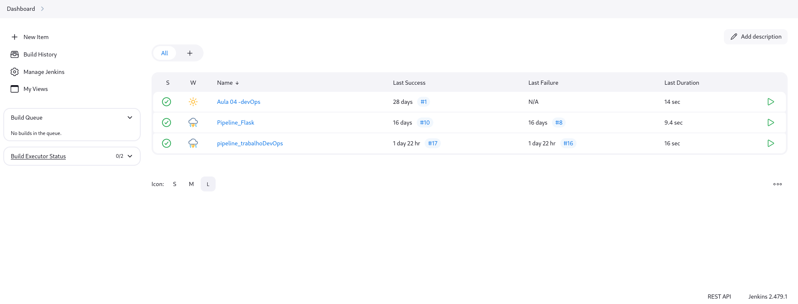
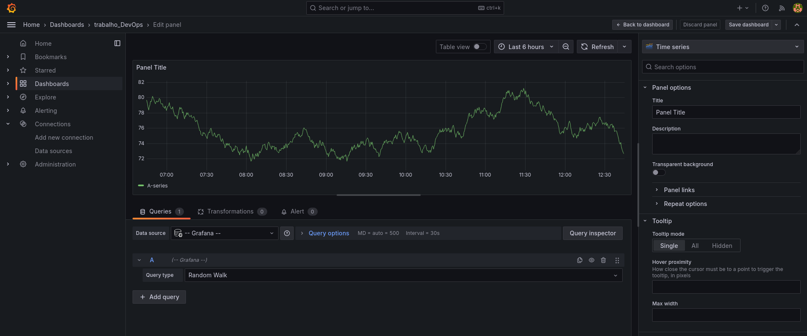

# 🚀 Trabalho DevOps - Monitoramento com Prometheus e Grafana

**Autor:** Leandro Pinecio Malizan  
**RA:** 23.9790-9  

---

## 📝 Descrição

Este projeto cria e automatiza um ambiente de monitoramento utilizando:  
- **Prometheus**: Para coleta de métricas.  
- **Grafana**: Para visualização em dashboards.  
- **Jenkins**: Para pipeline de integração e deploy.  

⚙️ **Objetivo:** Fornecer um ambiente robusto para monitorar uma aplicação Flask integrada ao banco MariaDB.  

---

## 📋 Índice
1. [Pré-requisitos](#pré-requisitos)  
2. [Configuração e Execução](#configuração-e-execução)  
   - [Iniciando o Jenkins](#1-iniciando-o-jenkins)  
   - [Criando o Pipeline](#2-criando-o-pipeline)  
   - [Executando o Pipeline](#3-executando-o-pipeline)  
   - [Rodando sem Jenkins](#4-rodando-sem-jenkins)  
   - [Acessando o Grafana](#5-acessando-o-grafana)  
3. [Estrutura do Pipeline](#estrutura-do-pipeline)  
4. [Dashboard no Grafana](#dashboard-no-grafana)  
5. [Resumo dos Passos](#resumo-dos-passos)  

---

## ✅ Pré-requisitos

Certifique-se de que o ambiente possui:  
- **Jenkins** instalado e configurado.  
- **Docker** e **Docker Compose**.  
- Acesso ao navegador para as URLs de serviços:  
  - Jenkins: [http://localhost:8080](http://localhost:8080)  
  - Grafana: [http://localhost:3000](http://localhost:3000)  

---

## ⚙️ Configuração e Execução

### 1. Iniciando o Jenkins
1. Certifique-se de que o Jenkins está rodando em:  
   [http://localhost:8080](http://localhost:8080).  
2. Faça login com suas credenciais.  


---

### 2. Criando o Pipeline
1. No Jenkins, clique em **"Nova Tarefa"**.  
2. Configure como **Pipeline** e insira:  
   - **SCM**: Git  
   - **Repositório**: `https://github.com/Badizan/Trabalho-Devops-23.9790-9`  
   - **Triggers**: `H/5 * * * *`.  


---

### 3. Executando o Pipeline
1. Na tela inicial do Jenkins, selecione o pipeline criado.  
2. Clique em **"Construir Agora"**.  
3. Monitore os logs e verifique a inicialização dos containers Docker.  


---

### 4. Rodando sem Jenkins
Se preferir rodar manualmente, utilize o seguinte comando no terminal:  
```bash
docker compose up --build -d
```

---

### 5. Acessando o Grafana

1. Abra o navegador e acesse:  
   [http://localhost:3000](http://localhost:3000).  
2. Faça login:  
   - **Usuário:** `admin`  
   - **Senha:** `admin` (ou a senha definida no ambiente).  
3. Ajuste o **Time Range** para **"Last 5 minutes"** no dashboard.  


---

## 📊 Estrutura do Pipeline

O pipeline executa as seguintes etapas:  
1. **Clonar Repositório:** Baixa o código do GitHub.  
2. **Teste:** Verifica se o código está funcionando corretamente.  
3. **Build:** Constrói os containers Docker.  
4. **Deploy:** Inicializa Prometheus e Grafana.  

  


---

## 📈 Dashboard no Grafana

No Grafana, visualize:  
- **Taxas de requisições HTTP**.  
- **Conexões no MariaDB**.  
- **Métricas do servidor Flask**.  


---

## 🔄 Resumo dos Passos

1. Configure o Jenkins e o pipeline.  
2. Execute o pipeline ou rode diretamente com Docker Compose.  
3. Acesse e explore as métricas no Grafana.  

---

## 💡 Observações

Este projeto foi desenvolvido para facilitar a integração de monitoramento em um ambiente automatizado. As instruções são detalhadas para que qualquer desenvolvedor consiga replicar o ambiente.
