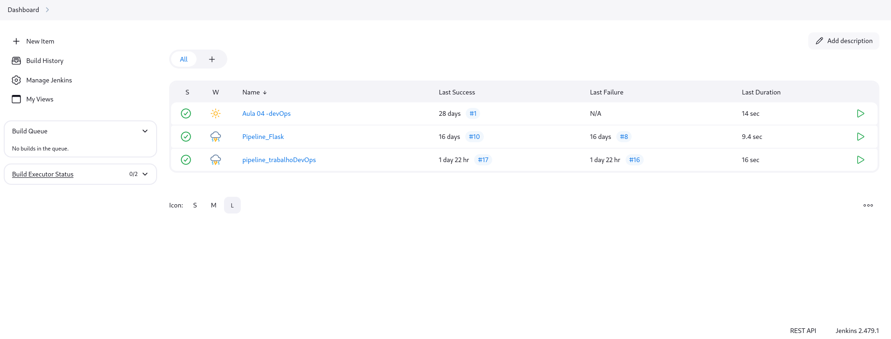
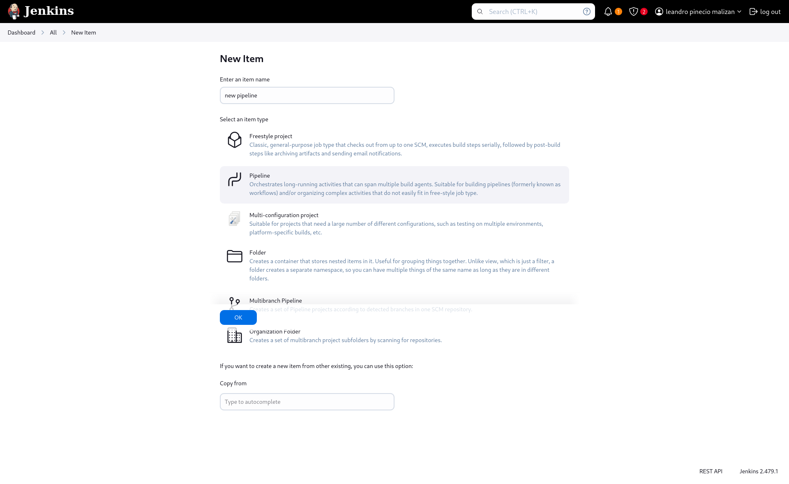
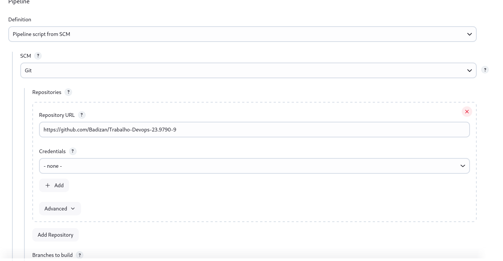
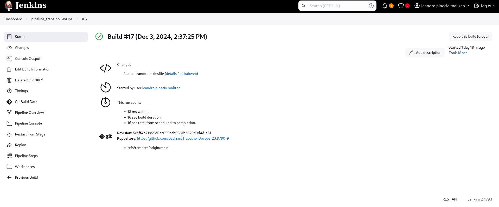
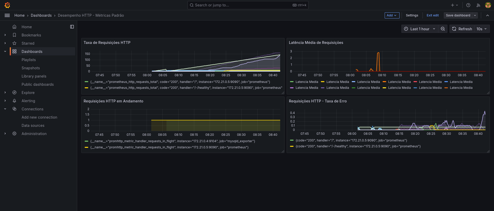

# 🚀 Documentação do Projeto  
**Autor:** Leandro Pinecio Malizan  
**RA:** 23.9790-9  

---

## 📝 Descrição  

Este projeto provisiona automaticamente um ambiente de monitoramento utilizando o **Grafana**, configurado para exibir um dashboard que monitora requisições de um servidor **Prometheus**. A automação inclui a integração com **Jenkins** para gerenciamento do pipeline de execução.  

---

## ✅ Pré-requisitos  

Certifique-se de que o ambiente possui:  
- **Jenkins** instalado e em execução.  
- **Docker** e **Docker Compose** configurados no ambiente do Jenkins.  
- **Acesso ao navegador** para visualizar as aplicações:  
  - Grafana: [http://localhost:3000](http://localhost:3000)  
  - Prometheus: [http://localhost:9090](http://localhost:9090)  
  - Jenkins: [http://localhost:8080](http://localhost:8080)  

---

## ⚙️ Passos para Configurar e Executar o Projeto  

### 1️⃣ Iniciar o Jenkins  

1. Certifique-se de que o **Jenkins** está em execução.  
   - Normalmente, ele estará disponível em [http://localhost:8080](http://localhost:8080).  

---

### 2️⃣ Criar uma Nova Pipeline no Jenkins  

#### Acessar o Jenkins  

1. Acesse o Jenkins em [http://localhost:8080](http://localhost:8080) e faça login.

### Tela Inicial do Jenkins:
  

---

#### Criar um Novo Item  

1. Clique em **"Nova Tarefa"**.  
2. Digite um nome para o pipeline, como `MonitoramentoDevOps`.  
3. Selecione a opção **Pipeline** e clique em **"OK"**.

### Tela de criação de Pipeline: 
  

---

#### Configurar o Pipeline  

1. Na página de configuração do pipeline:  
   - Role até a seção **Build Triggers** e selecione **Consultar periodicamente o SCM**.  
   - Adicione o seguinte texto para verificar o repositório a cada 5 minutos:  
     ```  
     H/5 * * * *  
     ```  
   - Role até a seção **Pipeline** e selecione a opção **Pipeline Script from SCM**.
  
### Tela de configuração de Pipeline:
  

---

#### Configurar Repositório SCM  

1. Em **SCM**, selecione **Git**.  
2. Insira o repositório Git onde o projeto está hospedado:  https://github.com/LeandroPinecio/TrabalhoDevOps.git

3. Configure as credenciais, se necessário.  
4. Clique em **Salvar**.  

---

### 3️⃣ Executar o Pipeline  

1. Volte para a página inicial do Jenkins e clique na pipeline recém-criada.  
2. Clique em **"Construir Agora"** para iniciar o pipeline.  

#### Monitorar a Execução  

1. Acompanhe os logs para verificar se os containers Docker (Prometheus, Grafana) foram provisionados corretamente.  
2. Certifique-se de que a etapa final indica que o serviço Grafana está em execução.

### Tela da Pipeline:
  

---

### 4️⃣ Rodar o Projeto Manualmente (Sem o Jenkins)  

Se preferir, é possível executar o projeto diretamente com o Docker Compose:  
1. Navegue até o diretório do projeto no terminal.  
2. Execute o comando:  
```bash  
docker compose up --build -d  
```
Após a execução, acesse as aplicações nos seguintes endereços:

- **Grafana:** [http://localhost:3000](http://localhost:3000)  
- **Prometheus:** [http://localhost:9090](http://localhost:9090)  

---

### 5️⃣ Acessar o Grafana  

1. Abra o navegador e vá para [http://localhost:3000](http://localhost:3000).  
2. Faça login no Grafana:  
   - **Usuário:** `admin`  
   - **Senha:** `admin` (ou a configurada no ambiente).  
3. Verifique o dashboard provisionado automaticamente e visualize as métricas de requisições.

### Dashboard que você verá no Grafana:
  

📝 **Nota:** O carregamento dos gráficos do dashboard pode demorar aproximadamente 30 segundos após acessar a aplicação. Configure o **Time Range** para **"Last 5 minutes"** para melhores resultados.  

---

## 📊 Resumo dos Passos  

1. Certifique-se de que o **Jenkins** está rodando (ou opte por rodar diretamente via **Docker Compose**).  
2. Crie uma nova pipeline no Jenkins seguindo as instruções acima.  
3. Execute a pipeline ou o comando:  
   ```bash
   docker compose up --build -d
   ```
4.Acesse a aplicação Flask em http://localhost:3000, o Grafana em http://localhost:3000 e explore o dashboard.

